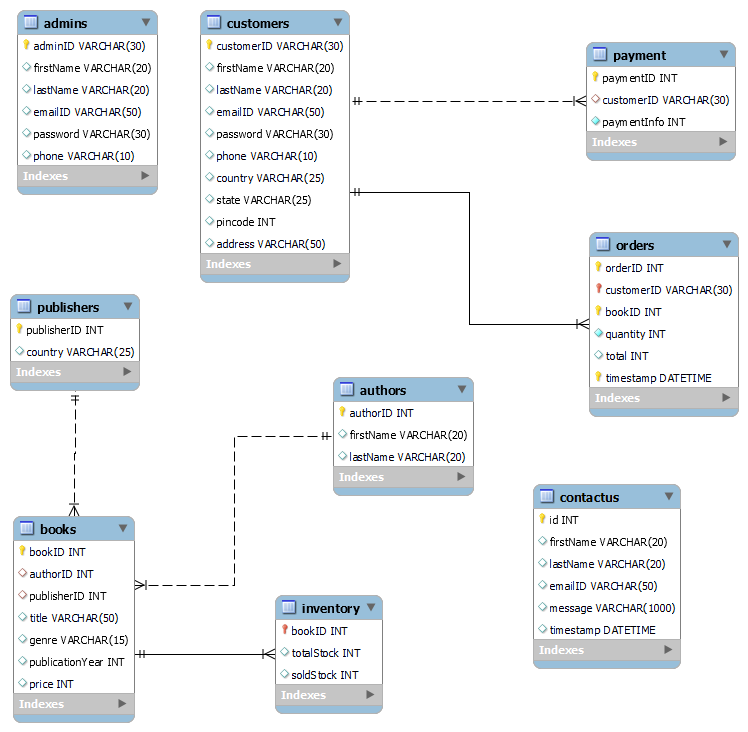

# Online BookStore Management Application
An application with two portals - admin and customer. 

Admins can add book ,delete book and update book. Admins can view the book Inventory(total and sold book stocks), all accounts and orders placed by customers in the application.

Customers can buy only one book at a time and with a quantity of 1 to 5 only. Customers have to register to purchase/view more books.

Customers and admin have a home page where all books by genre is displayed and details of book will be displayed on clicking a particular book.
They can search a book by title, genre or author name.

 
## Technology Stack
* **Frontend:** [HTML](https://html.com/), [CSS](https://developer.mozilla.org/en-US/docs/Web/CSS), [Bootstrap](https://getbootstrap.com/), [Javascript](https://developer.mozilla.org/en-US/docs/Web/JavaScript)
* **Backend:** [Python Flask](https://flask.palletsprojects.com/en/2.0.x/)
* **Database:** [MySQL](https://www.mysql.com/)

## Requirements
* [Visual Studio Code](https://code.visualstudio.com/)
* [MySQL Workbench](https://www.mysql.com/products/workbench/)
* [Python](https://www.python.org/)
* [Flask](https://pypi.org/project/Flask/)
    1. pip install flask  
    2. pip install python-dotenv
    3. pip install MySQL-python
    4. pip install mysql-connector

## Website Preview
### Admin Portal Preview
  [!Demo](https://user-images.githubusercontent.com/63465293/144717705-0444def6-41dc-4d17-ba48-0ac1ac2811a7.mp4)

### Customer Portal Preview
  [!Demo](https://user-images.githubusercontent.com/63465293/144717576-540e6beb-c630-4971-b98c-1bb670d7ad3b.mp4)

## Folder Structure
    .
    ├── static          
    |   └── bootstrap
    |   └── css
    |   └── images
    |   └── js
    ├── templates                   # html files 
    ├── utils                       # code files
    ├── app.py              
    ├── onlinebookstore db.sql      # tables and queries used for this project
    ├── .gitignore
    ├── requirements.txt
    ├── LICENSE
    └── README.md

## Extended Entity Diagram
