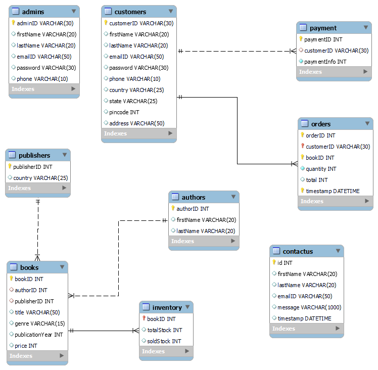

# Online BookStore Management Application
 
## Technology Stack
* **Frontend:** [HTML](https://html.com/), [CSS](https://developer.mozilla.org/en-US/docs/Web/CSS), [Bootstrap](https://getbootstrap.com/), [Javascript](https://developer.mozilla.org/en-US/docs/Web/JavaScript)
* **Backend:** [Python Flask](https://flask.palletsprojects.com/en/2.0.x/)
* **Database:** [MySQL](https://www.mysql.com/)

## Requirements
* [Visual Studio Code](https://code.visualstudio.com/)
* [MySQL Workbench](https://www.mysql.com/products/workbench/)
* [Python](https://www.python.org/)
* [Flask](https://pypi.org/project/Flask/)
    1. pip install flask  
    2. pip install python-dotenv
    3. pip install MySQL-python
    4. pip install mysql-connector

## Website Preview
[Click here](https://github.com/Geervanireddy16/online-bookstore-management/blob/main/README.md)

## Project Structure
    .
    ├── static          
    |   └── bootstrap
    |   └── css
    |   └── images
    |   └── js
    ├── templates                   # html files 
    ├── utils                       # code files
    ├── app.py              
    ├── onlinebookstore db.sql      # tables and queries used for this project
    ├── .gitignore
    ├── requirements.txt
    ├── LICENSE
    └── README.md

## Extended Entity Diagram
